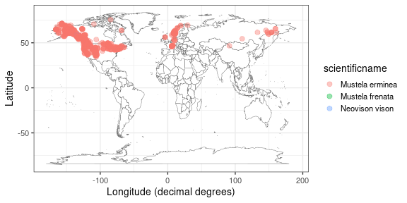

`rvertnet` is a client for interacting with [VertNet.org](http://vertnet.org/).

## Installation

Stable CRAN version


```r
install.packages("rvertnet")
```

Development version from GitHub


```r
remotes::install_github("ropensci/rvertnet", build_vignettes = TRUE)
```

## Loading the package


```r
library('rvertnet')
```

## Search by term

Search for _Aves_ in the state of _California_, limit to 10 records


```r
res <- searchbyterm(class = "Aves", state = "California", limit = 10, messages = FALSE)
```

All major functions (`searchbyterm()`, `spatialsearch()`, `vertsearch()`) give back a `meta` (for metadata, in a list) and `data` (for data, in a data.frame) slot. The metadata:


```r
res$meta
#> $request_date
#> [1] "2024-02-12T00:06:06.362106"
#> 
#> $response_records
#> [1] 10
#> 
#> $submitted_query
#> [1] "class:Aves"
#> 
#> $request_origin
#> [1] "47.606139,-122.332848"
#> 
#> $limit
#> [1] 10
#> 
#> $last_cursor
#> [1] "False:CskFCtIDCqQD9wAAABn_____jIGJmo2LkZqL0o-QjYuek96WkZuah9LNz87M0s_H0s_H_wAA_3RtoKCZi4ygoP8AAP9dno-PmpGYlpGa_wAA_3N0bZaRm5qH_wAA_12biJz_AAD_c3Rtm5CcoJab_wAA_12ektCQjZGWi5eQk5CYhtDPz87GmcjGztLGzcbJ0svPzprSxsfGy9Kdycqcz53NnMfGnpv_AAD_c3-ektCQjZGWi5eQk5CYhtDPz87GmcjGztLGzcbJ0svPzprSxsfGy9Kdycqcz53NnMfGnpv_AAD__wD-__6MgYmajYuRmovSj5CNi56T3paRm5qH0s3PzszSz8fSz8f_AHRtoKCZi4ygoP8AXZ6Pj5qRmJaRmv8Ac3RtlpGbmof_AF2biJz_AHN0bZuQnKCWm_8AXZ6S0JCNkZaLl5CTkJiG0M_PzsaZyMbO0sbNxsnSy8_OmtLGx8bL0p3JypzPnc2cx8aem_8Ac3-ektCQjZGWi5eQk5CYhtDPz87GmcjGztLGzcbJ0svPzprSxsfGy9Kdycqcz53NnMfGnpv_AP_-EAoh214v0Zsk1Mk5AAAAAOb___9IClAAWgsJJ5Q__S_keXEQA2DimaKpBRINRG9jdW1lbnRJbmRleBrAAShBTkQgKElTICJjdXN0b21lcl9uYW1lIiAiYXBwZW5naW5lIikgKElTICJncm91cF9uYW1lIiAic352ZXJ0bmV0LXBvcnRhbCIpIChJUyAibmFtZXNwYWNlIiAiaW5kZXgtMjAxMy0wOC0wOCIpIChJUyAiaW5kZXhfbmFtZSIgImR3YyIpIChPUiAoUVQgIkF2ZXMiICJydGV4dF9jbGFzcyIpIChJUyAicmF0b21fY2xhc3MiICJhdmVzIikpKToZCgwoTiBvcmRlcl9pZCkQARkAAAAAAADw_0oFCABA6Ac"
#> 
#> $query_version
#> [1] "search.py 2016-08-15T16:43+02:00"
#> 
#> $matching_records
#> [1] ">10000"
#> 
#> $api_version
#> [1] "api.py 2017-11-24T12:16-03:00"
```

Inspect data. A `tibble` is returned, so you get a nice brief data summary:


```r
res$data
#> # A tibble: 10 × 46
#>    kingdom  recordedby    higherclassification stateprovince basisofrecord month
#>    <chr>    <chr>         <chr>                <chr>         <chr>         <chr>
#>  1 Animalia NSW STATE GO… Animalia | Chordata… New South Wa… PreservedSpe… 11   
#>  2 Animalia TARONGA ZOO … Animalia | Chordata… New South Wa… PreservedSpe… 6    
#>  3 Animalia MCLENNAN, MR… Animalia | Chordata… Queensland    PreservedSpe… 4    
#>  4 Animalia WATTS, MIKE   Animalia | Chordata… New South Wa… PreservedSpe… 1    
#>  5 Animalia HOLCOMBE, B.  Animalia | Chordata… New South Wa… PreservedSpe… 7    
#>  6 Animalia RHODES, C. A. Animalia | Chordata… New South Wa… PreservedSpe… 10   
#>  7 Animalia C. HEDLEY, A… Animalia | Chordata… Queensland    PreservedSpe… 10   
#>  8 Animalia ROBINSON, SEP Animalia | Chordata… New South Wa… PreservedSpe… 10   
#>  9 Animalia SHARP, GEORGE Animalia | Chordata… Queensland    PreservedSpe… 11   
#> 10 Animalia J.A. KEAST, … Animalia | Chordata… New South Wa… PreservedSpe… 3    
#> # ℹ 40 more variables: decimallongitude <chr>, phylum <chr>, references <chr>,
#> #   year <chr>, startdayofyear <chr>, taxonrank <chr>, specificepithet <chr>,
#> #   bibliographiccitation <chr>, family <chr>, countrycode <chr>,
#> #   geodeticdatum <chr>, coordinateuncertaintyinmeters <chr>,
#> #   highergeography <chr>, accessrights <chr>, verbatimlocality <chr>,
#> #   verbatimeventdate <chr>, day <chr>, eventid <chr>, collectioncode <chr>,
#> #   occurrencestatus <chr>, locationremarks <chr>, coordinateprecision <chr>, …
```

Search for _Mustela nigripes_ in the states of _Wyoming_ or _South Dakota_, limit to 20 records


```r
res <- searchbyterm(specificepithet = "nigripes", genus = "Mustela", state = "(wyoming OR south dakota)", limit = 20, messages = FALSE)
res$data
#> # A tibble: 20 × 76
#>    month decimallongitude startdayofyear accessrights                    kingdom
#>    <chr> <chr>            <chr>          <chr>                           <chr>  
#>  1 1     -88.305352       1              http://vertnet.org/resources/n… Animal…
#>  2 03    -104.77472       74             http://vertnet.org/resources/n… Animal…
#>  3 02    -103.731861      52             http://vertnet.org/resources/n… Animal…
#>  4 12    -105.0137067407  349            http://vertnet.org/resources/n… Animal…
#>  5 2     -103.067931      32             http://vertnet.org/resources/n… Animal…
#>  6 1     -103.067931      1              http://vertnet.org/resources/n… Animal…
#>  7 02    -103.067931      40             http://vertnet.org/resources/n… Animal…
#>  8 05    -104.926320116   126            http://vertnet.org/resources/n… Animal…
#>  9 02    -104.79742       42             http://vertnet.org/resources/n… Animal…
#> 10 04    -106.1329632593  108            http://vertnet.org/resources/n… Animal…
#> 11 10    -105.064706      304            http://vertnet.org/resources/n… Animal…
#> 12 4     -106.3467709375  92             http://vertnet.org/resources/n… Animal…
#> 13 05    -104.225829      133            http://vertnet.org/resources/n… Animal…
#> 14 09    -105.873904      258            http://vertnet.org/resources/n… Animal…
#> 15 12    -105.298898      362            http://vertnet.org/resources/n… Animal…
#> 16 06    -105.376986      152            http://vertnet.org/resources/n… Animal…
#> 17 11    -104.3831505257  305            http://vertnet.org/resources/n… Animal…
#> 18 11    -104.7714765     314            http://vertnet.org/resources/n… Animal…
#> 19 09    -106.9094        267            http://vertnet.org/resources/n… Animal…
#> 20 08    -107.5579841     234            http://vertnet.org/resources/n… Animal…
#> # ℹ 71 more variables: verbatimcoordinatesystem <chr>, day <chr>,
#> #   identificationverificationstatus <chr>, occurrenceid <chr>,
#> #   identificationqualifier <chr>, georeferenceddate <chr>,
#> #   verbatimeventdate <chr>, coordinateuncertaintyinmeters <chr>,
#> #   higherclassification <chr>, sex <chr>, year <chr>, specificepithet <chr>,
#> #   basisofrecord <chr>, geodeticdatum <chr>, occurrenceremarks <chr>,
#> #   highergeography <chr>, continent <chr>, scientificname <chr>, …
```

Search for class _Aves_, in the state of _Nevada_, with a coordinate uncertainty range (in meters) of less than 25 meters


```r
res <- searchbyterm(class = "Aves", stateprovince = "Nevada", error = "<25", messages = FALSE)
res$data
#> # A tibble: 1,000 × 91
#>    georeferenceprotocol       higherclassification stateprovince lifestage month
#>    <chr>                      <chr>                <chr>         <chr>     <chr>
#>  1 MaNIS/HerpNet/ORNIS Geore… Animalia; Chordata;… Nevada        U-Ad.     3    
#>  2 MaNIS/HerpNet/ORNIS Geore… Animalia; Chordata;… Nevada        U-Ad      12   
#>  3 MaNIS/HerpNet/ORNIS Geore… Animalia; Chordata;… Nevada        Nestling  5    
#>  4 MaNIS/HerpNet/ORNIS Geore… Animalia; Chordata;… Nevada        U-Ad.     9    
#>  5 MaNIS/HerpNet/ORNIS Geore… Animalia; Chordata;… Nevada        U-Ad.     9    
#>  6 MaNIS/HerpNet/ORNIS Geore… Animalia; Chordata;… Nevada        U-Ad.     9    
#>  7 MaNIS/HerpNet/ORNIS Geore… Animalia; Chordata;… Nevada        Downy     6    
#>  8 MaNIS/HerpNet/ORNIS Geore… Animalia; Chordata;… Nevada        U-Ad.     6    
#>  9 MaNIS/HerpNet/ORNIS Geore… Animalia; Chordata;… Nevada        U-Ad.     6    
#> 10 MaNIS/HerpNet/ORNIS Geore… Animalia; Chordata;… Nevada        U-Ad.     6    
#> # ℹ 990 more rows
#> # ℹ 86 more variables: decimallongitude <chr>, phylum <chr>,
#> #   verbatimlongitude <chr>, year <chr>, specificepithet <chr>,
#> #   bibliographiccitation <chr>, verbatimlatitude <chr>, family <chr>,
#> #   locality <chr>, geodeticdatum <chr>, coordinateuncertaintyinmeters <chr>,
#> #   highergeography <chr>, continent <chr>, scientificnameauthorship <chr>,
#> #   day <chr>, kingdom <chr>, institutioncode <chr>, scientificname <chr>, …
```

### dplyr downstream

You can pass the data object directly on to `dplyr` functions. Here, we get a table of record counts by species in descending order.


```r
library("dplyr")
out <- searchbyterm(genus = "Ochotona", limit = 800)
out$data %>%
  group_by(scientificname) %>%
  summarise(count = length(scientificname)) %>%
  arrange(desc(count))
#> # A tibble: 20 × 2
#>    scientificname                  count
#>    <chr>                           <int>
#>  1 Ochotona princeps                 450
#>  2 Ochotona pallasi                  129
#>  3 Ochotona princeps saxatilis       103
#>  4 Ochotona hyperborea                30
#>  5 Ochotona dauurica                  21
#>  6 Ochotona collaris                  15
#>  7 Ochotona princeps figginsi         14
#>  8 Ochotona princeps taylori           8
#>  9 Ochotona princeps schisticeps       6
#> 10 Ochotona alpina                     4
#> 11 Ochotona princeps muiri             4
#> 12 Ochotona hyperborea mantchurica     3
#> 13 Ochotona princeps incana            3
#> 14 Ochotona princeps princeps          3
#> 15 Ochotona princeps murri             2
#> 16 Ochotona princeps brunnescens       1
#> 17 Ochotona princeps jewetti           1
#> 18 Ochotona princeps tutelata          1
#> 19 Ochotona princeps uinta             1
#> 20 Ochotona princeps ventorum          1
```

## Spatial search

Spatial search service allows only to search on a point defined by latitude and longitude pair, with a radius (meters) from that point. All three parameters are required. 


```r
res <- spatialsearch(lat = 33.529, lon = -105.694, radius = 2000, limit = 10, messages = FALSE)
res$data
#> # A tibble: 10 × 62
#>    month decimallongitude startdayofyear minimumelevationinmeters accessrights  
#>    <chr> <chr>            <chr>          <chr>                    <chr>         
#>  1 07    -105.68633       193            2182.368                 http://vertne…
#>  2 07    -105.705479      196            2023.872                 http://vertne…
#>  3 07    -105.705479      196            2023.872                 http://vertne…
#>  4 07    -105.705479      196            2023.872                 http://vertne…
#>  5 07    -105.705479      196            2023.872                 http://vertne…
#>  6 07    -105.705479      196            2023.872                 http://vertne…
#>  7 07    -105.705479      196            2023.872                 http://vertne…
#>  8 07    -105.705479      196            2023.872                 http://vertne…
#>  9 07    -105.705479      196            2023.872                 http://vertne…
#> 10 07    -105.705479      196            2023.872                 http://vertne…
#> # ℹ 57 more variables: kingdom <chr>, day <chr>,
#> #   identificationverificationstatus <chr>, occurrenceid <chr>,
#> #   identificationqualifier <chr>, georeferenceddate <chr>,
#> #   verbatimeventdate <chr>, coordinateuncertaintyinmeters <chr>,
#> #   higherclassification <chr>, sex <chr>, year <chr>, specificepithet <chr>,
#> #   basisofrecord <chr>, geodeticdatum <chr>, occurrenceremarks <chr>,
#> #   highergeography <chr>, continent <chr>, scientificname <chr>, …
```

## Global full text search

`vertsearch()` provides a simple full text search against all fields. For more info see [the docs](https://github.com/VertNet/webapp/wiki/The-API-search-function#global-full-text-search). An example:


```r
res <- vertsearch(taxon = "aves", state = "california", limit = 10)
res$data
#> # A tibble: 10 × 57
#>    higherclassification       stateprovince basisofrecord month decimallongitude
#>    <chr>                      <chr>         <chr>         <chr> <chr>           
#>  1 Animalia | Chordata |  | … California    PreservedSpe… 2     -121.7833       
#>  2 Animalia | Chordata |  | … California    PreservedSpe… 6     -122.15         
#>  3 Animalia | Chordata |  | … California    PreservedSpe… 5     -120.9014       
#>  4 Animalia; Chordata; Aves;… South Caroli… PreservedSpe… 2     -79.86151       
#>  5 Animalia; Chordata; Aves;… California    PreservedSpe… 1     -121.93300      
#>  6 Animalia; Chordata; Aves;… California    PreservedSpe… 1     -121.93300      
#>  7 Animalia; Chordata; Aves;… California    PreservedSpe… 7     -121.85760      
#>  8 Animalia; Chordata; Aves;… California    PreservedSpe… 7     -121.85760      
#>  9 Animalia; Chordata; Aves;… California    PreservedSpe… 7     -121.85760      
#> 10 Animalia; Chordata; Aves;… California    PreservedSpe… 7     -121.85760      
#> # ℹ 52 more variables: phylum <chr>, references <chr>, year <chr>,
#> #   startdayofyear <chr>, taxonrank <chr>, specificepithet <chr>,
#> #   bibliographiccitation <chr>, family <chr>, countrycode <chr>,
#> #   geodeticdatum <chr>, coordinateuncertaintyinmeters <chr>,
#> #   highergeography <chr>, continent <chr>, verbatimlocality <chr>, day <chr>,
#> #   kingdom <chr>, collectioncode <chr>, occurrencestatus <chr>,
#> #   coordinateprecision <chr>, institutioncode <chr>, scientificname <chr>, …
```

Limit the number of records returned (under 1000)


```r
res <- vertsearch("(kansas state OR KSU)", limit = 200)
res$data
#> # A tibble: 200 × 78
#>    individualcount georeferenceprotocol         recordedby bibliographiccitation
#>    <chr>           <chr>                        <chr>      <chr>                
#>  1 8               GEOLocate (Rios & Bart, 201… H. W. Rob… Academy of Natural S…
#>  2 11              GEOLocate (Rios & Bart, 201… H. W. Rob… Academy of Natural S…
#>  3 3               GEOLocate (Rios & Bart, 201… H. W. Rob… Academy of Natural S…
#>  4 <NA>            <NA>                         <NA>       California Academy o…
#>  5 <NA>            <NA>                         <NA>       California Academy o…
#>  6 <NA>            <NA>                         <NA>       California Academy o…
#>  7 1               VertNet Georeferencing Guid… MCCOY, C … Carnegie Museum of N…
#>  8 1               VertNet Georeferencing Guid… MCCOY, C … Carnegie Museum of N…
#>  9 1               VertNet Georeferencing Guid… MCCOY, C … Carnegie Museum of N…
#> 10 1               VertNet Georeferencing Guid… MCCOY, C … Carnegie Museum of N…
#> # ℹ 190 more rows
#> # ℹ 74 more variables: stateprovince <chr>, basisofrecord <chr>, month <chr>,
#> #   decimallongitude <chr>, phylum <chr>, references <chr>,
#> #   georeferencedby <chr>, year <chr>, taxonrank <chr>, specificepithet <chr>,
#> #   family <chr>, countrycode <chr>, locality <chr>, geodeticdatum <chr>,
#> #   coordinateuncertaintyinmeters <chr>, highergeography <chr>,
#> #   continent <chr>, day <chr>, kingdom <chr>, georeferenceddate <chr>, …
```

Pass output of `vertsearch()` to a map


```r
out <- vertsearch(tax = "(mustela nivalis OR mustela erminea)")
vertmap(out)
```



## Lots of data

For `searchbyterm()`, `spatialsearch()`, and `vertsearch()`, you can request more than 1000 records. VertNet limits each request to 1000 records, but internally in this package, if you request more than 1000 records, we'll continue to send requests to get all the records you want. See the [VertNet docs](https://github.com/VertNet/webapp/wiki/The-API-search-function#retrieving-large-result-sets) for more information on this.

## Email dump of data

`bigsearch()` specifies a termwise search (like `searchbyterm()`), but requests that all available records be made available for download as a tab-delimited text file.


```r
bigsearch(genus = "ochotona", rfile = "mydata", email = "you@gmail.com")
#> Processing request...
#> 
#> Download of records file 'mydata' requested for 'you@gmail.com'
#> 
#> Query/URL: "http://api.vertnet-portal.appspot.com/api/download?q=%7B%22q%22:%22genus:ochotona%22,%22n%22:%22mydata%22,%22e%22:%22you@gmail.com%22%7D"
#> 
#> Thank you! Download instructions will be sent by email.
```

## Messages

In the previous examples, we've suppressed messages for more concise output, but you can set `messages=TRUE` to get helpful messages - `messages=TRUE` is also the default setting so if you don't specify that parameter messages will be printed to the console. 


```r
res <- searchbyterm(class = "Aves", state = "California", limit = 10, messages = TRUE)
```
